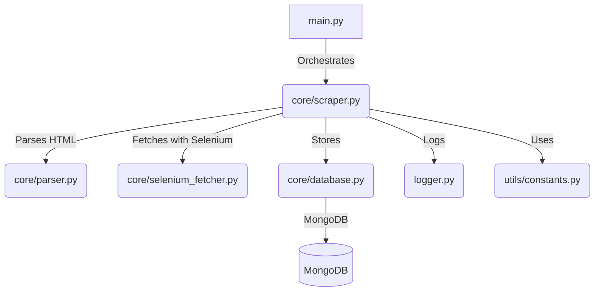

# Yad2 Real Estate Scraper

A production-grade, asynchronous Python scraper for extracting real estate listings from Yad2, designed for scalability, reliability, and extensibility. Integrates with MongoDB for persistent storage and supports embedding generation for downstream ML tasks.

---

## Features
- **Fully Asynchronous**: Utilizes `aiohttp` and `asyncio` for high-throughput, non-blocking scraping.
- **Robust Error Handling**: Retries, exponential backoff, and granular logging for resilience against network and site issues.
- **Configurable Batching & Concurrency**: Environment-driven control over batch size, concurrency, and timeouts.
- **MongoDB Integration**: Deduplicated, structured storage of listings.
- **Pluggable Embedding Generation**: Easily extend to generate and store text embeddings for ML/NLP applications.
- **Extensive Logging**: Rotating file and console logs for monitoring and debugging.
- **Modular Architecture**: Clean separation of scraping, parsing, database, and utility logic.

---

## Architecture Overview



---

## Setup

1. **Clone the repository**
   ```bash
   git clone <repo-url>
   cd clustering-the-crowd/Yad2_Scraper
   ```
2. **Install dependencies**
   ```bash
   pip install -r requirements.txt
   ```
3. **Configure environment variables**
   Set environment variables for configuration. You can export them in your shell or set them when running the script:
   ```bash
   export MONGODB_URI=mongodb://localhost:27017
   export DATABASE_NAME=yad2
   export COLLECTION_NAME=listings
   export TOTAL_PAGES=368
   export BATCH_SIZE=15
   export MAX_CONCURRENCY=10
   export SLEEP_BETWEEN_BATCHES=60
   export TIMEOUT_SECONDS=120
   ```
   
   Alternatively, you can create your own `.env` file locally (not tracked by git) with the above variables.

---

## Usage

Run the scraper from the project directory:

```bash
python main.py
```

- Scraping starts from the highest page number and proceeds backwards (configurable in `main.py`).
- Progress, errors, and batch status are logged to both console and `scraper.log`.

---

## Logging & Monitoring
- **File Logging**: Rotates at 5MB, keeps 3 backups (`scraper.log`, `scraper.log.1`, ...).
- **Console Logging**: INFO level and above for real-time feedback.
- **Error Handling**: All exceptions are logged with stack traces; failed pages are retried with exponential backoff.

---

## Configuration
- All runtime parameters are controlled via environment variables (see configuration example above).
- For production, tune `BATCH_SIZE`, `MAX_CONCURRENCY`, and `TIMEOUT_SECONDS` based on your hardware/network.
- MongoDB connection and collection are fully configurable.

---

## Extending & Customization
- **Parsing Logic**: Extend or modify `core/parser.py` to adapt to changes in Yad2's HTML or to extract additional fields.
- **Embedding Generation**: Add or update logic in `core/embeddings.py` for custom ML/NLP workflows.
- **Scraping Strategy**: Adjust `core/scraper.py` for new anti-bot measures or to support additional listing types.
- **Error Handling**: Enhance retry/backoff logic as needed for robustness.

---

## Best Practices
- **Respect robots.txt and site terms of service.**
- **Monitor logs regularly** for failed pages or parsing errors.
- **Test with small batches** before scaling up to avoid IP bans or data loss.
- **Keep dependencies up to date** and pin versions in `requirements.txt`.
- **Secure your MongoDB instance** if running in production.

---